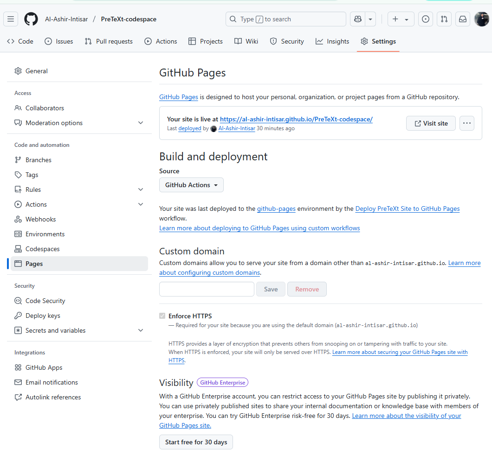
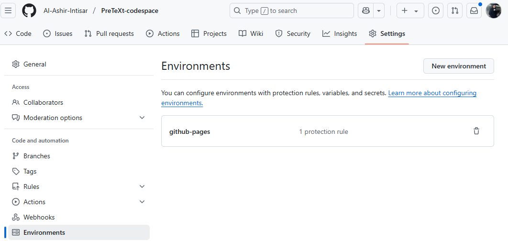
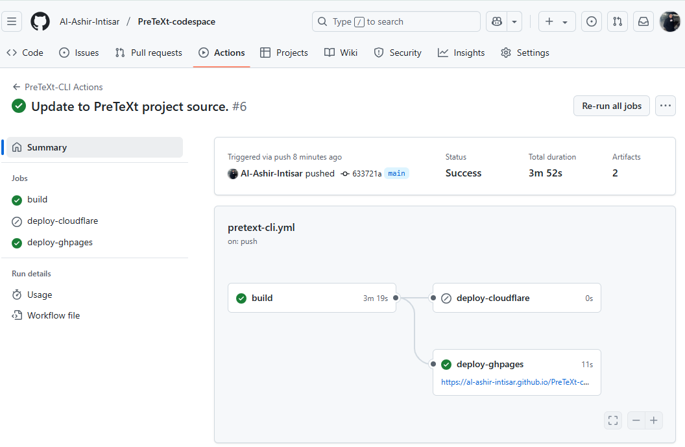

# PreTeXt Codespace

This repository is designed to help you quickly get started with [PreTeXt](https://pretextbook.org) by launching a GitHub Codespace. The following steps will guide you through building and deploying your PreTeXt project.

---

## 🚀 Quick Start Guide

## 🚀 How to Create Your Own PreTeXt-Codespace Repository

There are two easy ways to set up your own PreTeXt-enabled Codespace:

### ✅ Option 1: Fork This Repository

1. Visit [fragandi/CURITutorialDevelopment2025](https://github.com/fragandi/CURITutorialDevelopment2025).

2. Click **"Fork"** (top-right) to copy it to your GitHub account.
3. Open your new forked repository and click **"Code" → "Create codespace on main"**.

### 🛠️ Option 2: Set Up a Fresh Repository Manually

1. Create a new GitHub repository in your account.
2. Copy the entirity of `.devcontainer/`, `.github/`, `.gitignore`, `requirements.txt` folder from [fragandi/CURITutorialDevelopment2025](https://github.com/fragandi/CURITutorialDevelopment2025).
3. (Recommended) Also copy the following for a smoother experience:
   - The `README_images/` folder and `README.md` file (for guidance and troubleshooting)
4. Push your changes and create a Codespace from the repository.

This option gives you more flexibility to customize your setup while keeping the essential PreTeXt environment.

Once the Codespace has finished creating, **check that PreTeXt is installed** by running:

```bash
pretext --version
```
If you see an error like **command not found**, follow these steps:

1. **Reload the VS Code Window**
   - Press `Ctrl+Shift+P` → type `Reload Window` → hit Enter.

2. **Kill the Existing Terminal (if open)**
   - Click the trash icon in the terminal panel or run `Terminal: Kill Terminal` from the command palette.

3. **Open a New Terminal**
   - Press `Ctrl+Shift+\`` (backtick) or go to *Terminal → New Terminal*.

4. **Build the Project**
   - Run:
     ```bash
     pretext build web
     ```

5. **Preview with CodeChat**
   - Use [CodeChat](https://github.com/PreTeXtBook/pretext-cli/wiki/Live-preview-with-CodeChat) for live preview:
     ```bash
     codechat serve
     ```

6. **Deploy to GitHub Pages**
   - Run:
     ```bash
     pretext deploy --pages
     ```
   - Deployment will also be triggered when changes are pushed to the  default (main) branch. 
   - If you encounter that github pages is not being deployed follow the instruction below:

---

## 🌐 GitHub Pages Configuration

Make sure to configure GitHub Pages to use **GitHub Actions** as the build and deployment source:

1. Go to your repository’s **Settings** → **Pages**.
2. Under **Build and deployment**, set the source to **GitHub Actions**.



---

## 🛠 GitHub Environment Configuration

Go to your repository **Settings** → **Environments** → click on `github-pages`, and make sure it looks similar to the following:


<br>


---

## ⏱ Deployment Time

Deployment usually takes about **4 minutes**. After triggering the deployment, wait a few minutes and then visit your GitHub Pages URL.


